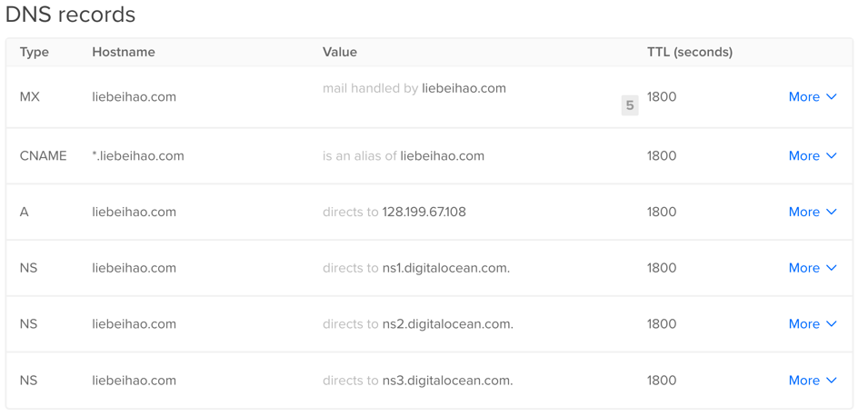

# Setup domain emails with multiple domains with postfix and gmail

Currently, I have two domains: nordenhunter.com and liebeihao.com. And I has already installed website in nordenhunter.com and used postfix to transfer all the emails through xfsnowind@gmail.com to info@nordenhunter.com. Now I need to move the website from http://nordenhunter.com to http://liebeihao.com and the email transferring service also needs to change to domain info@liebeihao.com and the original email info@nordenhunter.com also needs to be kept, all the emails to it should be transferred to liebeihao@gmail.com as well, while all the emails from liebeihao@gmail.com.

## Step 1: Add dns records for domains

First, in existing server http://nordenhunter.com, I need to add the domain records for liebeihao.com, 

**A Records**: Use this space to enter in an IP address of the server that you want to host your domain name on and the host name itself. The hostname will be prepended to your domain name.

Need to add a A record with the Hostname @ and the value of the IP.

**CNAME Record**: The CNAME record works as an alias of the A Record, pointing a subdomain to an A record - if an A Record’s IP address changes, the CNAME will follow to the new address.

I would like to direct all the subdomains to the host with IP. So add a CNAME Record that the value of HOSTNAME is * and the alias set as @.

**MX Records**: The MX Records fields include HOSTNAME, which determines which hosts the mail record should apply to, the MAIL PROVIDERS MAIL SERVER field, which points to the actual mail server, and the PRIORITY field, which designates the order in which the mail servers should contacted.

Add this MX Records 


## Step 2: Receiving email

### Set up the Postfix

We'll use [Postfix](http://www.postfix.org) as email server. Assuming the system is ubuntu, install it with command

```bash
$ sudo apt install postfix
```
### Configure proxy table

To configure the postfix, firstly, fill the file `/etc/postfix/virtual` (if not exist, create it) with the following content.

```bash
# Forwarding mapping, one from-to address pair per line. The format is:
#     <forward-from-addr> <whitespace> <forward-to-addr>

info@nordenhunter.com liebeihao@gmail.com
info@liebeihao.com liebeihao@gmail.com
```

Therefore, all emails sent to `info@liebeihao.com` and `info@nordenhunter.com` will be forwarded to `liebeihao@gmail.com`.

### Update the table

It turns out that Postfix doesn’t actually read `/etc/postfix/virtual` (surprise!); instead, what it reads is a lookup table generated from it. So, let’s generate the lookup table from our `/etc/postfix/virtual`:

```bash
$ sudo postmap /etc/postfix/virtual
```

### Restart the postfix

It’s now time to (re)start Postfix with our new configuration:

```bash
$ sudo postfix start
$ sudo postfix reload
```

## Step 3: Sending emails

### Username & password

Gmail requires a relay server (a server that will send emails to their destination on behalf it) to speak TLS, which protects the communication between Gmail and the relay server.

```bash
$ sudo apt-get install sasl2-bin libsasl2-modules
```

Open relays are a terrible idea. We want to use sasl to protect the communication between our server and gmail server.

we use `saslpasswd2` to create a username and password, with username `info` (this `info` is the user of email `info@liebeihao.com` in the file `/etc/postfix/virtual`)

```bash
$ sudo saslpasswd2 -c -u liebeihao.com info
Password:
Again (for verification):
```
**Remember: this password will be the one used to encrypted in the gmail.**

Verify username:

```bash
$ sudo sasldblistusers2
info@liebeihao.com: userPassword
```

Now, we make sure only Postfix can read this file:

```bash
$ sudo chmod 400 /etc/sasldb2
$ sudo chown postfix /etc/sasldb2
```

Lastly, we tell Cyrus SASL to use the file-based database to authenticate. Create the file `/etc/postfix/sasl/smtpd.conf`:

```bash
pwcheck_method: auxprop
auxprop_plugin: sasldb
mech_list: PLAIN LOGIN CRAM-MD5 DIGEST-MD5 NTLM
log_level: 7
```

### Configure `/etc/postfix/main.cf`

Modify the file `/etc/postfix/main.cf` with following content:

```bash
myhostname = liebeihao.com
smtpd_banner = $myhostname ESMTP $mail_name (Ubuntu)
biff = no

# appending .domain is the MUA's job.
append_dot_mydomain = no

# Uncomment the next line to generate "delayed mail" warnings
#delay_warning_time = 4h

readme_directory = no

# TLS parameters
smtpd_tls_session_cache_database = btree:${data_directory}/smtpd_scache
smtp_tls_session_cache_database = btree:${data_directory}/smtp_scache

# See /usr/share/doc/postfix/TLS_README.gz in the postfix-doc package for
# information on enabling SSL in the smtp client.

smtpd_relay_restrictions = permit_mynetworks permit_sasl_authenticated defer_unauth_destination
alias_maps = hash:/etc/aliases
alias_database = hash:/etc/aliases
virtual_alias_domains = nordenhunter.com, liebeihao.com
virtual_alias_maps = hash:/etc/postfix/virtual
myorigin = $myhostname
mydestination = liebeihao.com, localhost.liebeihao.com, localhost, nordenhunter.com, localhost.nordenhunter.com
# relayhost =·
mynetworks = 127.0.0.0/8 [::ffff:127.0.0.0]/104 [::1]/128
mailbox_size_limit = 0
recipient_delimiter = +
inet_interfaces = all
inet_protocols = all
relayhost =
message_size_limit = 0
```
### SSL Certificate

We need a self signed SSL key to enable TLS. The `password` below must be the same, I set it as `liebeihao.com`.

1. **Generate a private key for the server**

   ```bash
	$ sudo openssl genrsa -des3 -out liebeihao.com.key 2048
	Generating RSA private key, 2048 bit long modulus
	.................................................................................+++
	......................+++
	e is 65537 (0x10001)
	Enter pass phrase for liebeihao.com.key: <- Enter a password
	Verifying – Enter pass phrase for mail.domain.tld.key: <- Enter your password
	```

2. **Create a certificate request**

   ```bash
	$ sudo openssl req -new -key liebeihao.com.key -out liebeihao.com.csr
	Enter pass phrase for liebeihao.com.key: <- Enter a password
	You are about to be asked to enter information that will be incorporated
	into your certificate request.
	What you are about to enter is what is called a Distinguished Name or a DN.
	There are quite a few fields but you can leave some blank
	For some fields there will be a default value,
	If you enter '.', the field will be left blank.
	-----
	Country Name (2 letter code) [AU]:NO
	State or Province Name (full name) [Some-State]:Hordaland
	Locality Name (eg, city) []:Bergen
	Organization Name (eg, company) [Internet Widgits Pty Ltd]:liebeihao
	Organizational Unit Name (eg, section) []:IT
	Common Name (e.g. server FQDN or YOUR name) []:liebeihao.com
	Email Address []:liebeihao@gmail.com
	
	Please enter the following 'extra' attributes
	to be sent with your certificate request
	A challenge password []: <- Leave empty
	An optional company name []:
	```

3. **Create a self signed key**

   ```bash
   $ sudo openssl x509 -req -days 3650 -in liebeihao.com.csr -signkey liebeihao.com.key -out liebeihao.com.crt
   Signature ok
	subject=/C=NO/ST=Hordaland/L=Bergen/O=liebeihao/OU=IT/CN=liebeihao.com/emailAddress=liebeihao@gmail.com
	Getting Private key
	Enter pass phrase for liebeihao.com.key: <- Enter a password
   ```
   
4. **Remove the password from the private certificate (we do this, so we don’t have to enter a password when you restart postfix)**

	```bash
	$ sudo openssl rsa -in liebeihao.com.key -out liebeihao.com.key.nopass
	Enter pass phrase for liebeihao.com.key: <- Enter a password
	writing RSA key
	
	$ sudo mv liebeihao.com.key.nopass liebeihao.com.key
	```

5. **Make ourself a trusted CA**

	```bash
	$ sudo openssl req -new -x509 -extensions v3_ca -keyout liebeihao.com.cakey.pem -out liebeihao.com.cacert.pem -days 3650
	Generating a 2048 bit RSA private key
	..........................................................................+++
	...........................................+++
	writing new private key to 'liebeihao.com.cakey.pem'
	Enter PEM pass phrase:
	Verifying - Enter PEM pass phrase:
	-----
	You are about to be asked to enter information that will be incorporated
	into your certificate request.
	What you are about to enter is what is called a Distinguished Name or a DN.
	There are quite a few fields but you can leave some blank
	For some fields there will be a default value,
	If you enter '.', the field will be left blank.
	-----
	Country Name (2 letter code) [AU]:NO
	State or Province Name (full name) [Some-State]:Hordaland
	Locality Name (eg, city) []:Bergen
	Organization Name (eg, company) [Internet Widgits Pty Ltd]:liebeihao
	Organizational Unit Name (eg, section) []:IT
	Common Name (e.g. server FQDN or YOUR name) []:liebeihao.com
	Email Address []:liebeihao@gmail.com
	```
	
6. **Copy the files into a proper location**

	```bash
	$ sudo chmod 600 liebeihao.com.key
	$ sudo chmod 600 liebeihao.com.cakey.pem
	$ sudo mv liebeihao.com.key /etc/ssl/private/
	$ sudo mv liebeihao.com.crt /etc/ssl/certs/
	$ sudo mv liebeihao.com.cakey.pem /etc/ssl/private/
	$ sudo mv liebeihao.com.cacert.pem /etc/ssl/certs/
	```
7. **Tell Postfix where the keys are and use TLS**

	```bash
	$ sudo postconf -e 'smtpd_tls_key_file = /etc/ssl/private/liebeihao.com.key'
	$ sudo postconf -e 'smtpd_tls_cert_file = /etc/ssl/certs/liebeihao.com.crt'
	$ sudo postconf -e 'smtpd_tls_CAfile = /etc/ssl/certs/liebeihao.com.cacert.pem'
	$ sudo postconf -e 'smtp_use_tls = yes'
	$ sudo postconf -e 'smtpd_use_tls = yes'
	$ sudo postconf -e 'smtpd_tls_auth_only = no'
	```
	These commands will also insert configuration to the file `/etc/postfix/main.cf`.

### Relay server

The final step is to configure Postfix to enable relaying of e-mail on behalf of Gmail.

Let’s open up /etc/postfix/master.cf. This file should already contain a bunch of config options, some of which are commented out. Uncomment the lines starting with submission and edit them to match the following:

```bash
submission inet n       -       n       -       -       smtpd
  -o syslog_name=postfix/submission
  -o smtpd_tls_security_level=encrypt
  -o smtpd_sasl_auth_enable=yes
  -o smtpd_tls_cert_file=/etc/ssl/certs/liebeihao.com.crt
  -o smtpd_reject_unlisted_recipient=no
  -o smtpd_relay_restrictions=permit_sasl_authenticated,reject
  -o milter_macro_daemon_name=ORIGINATING
```

### Restart

```bash
$ sudo postfix reload
```

If all went well, you should see Postfix serving a relay server, protected by our user name and password in /etc/sasldb2, on port 587.

## Step 4: Configure Gmail

Let’s go to ***Settings > Accounts and Import*** and click ***Add another email address you own***.


In the dialog that pops up, fill in our target e-mail address and click ***Next Step***.


In the next dialog, enter the username `info@liebeihao.com` instead of `info` and the password set with `saslpasswd2` above. Check the correct port is 587 and the correct security protocol (TLS) are selected, then click ***Add Account***.


If the configuration of postfix is correct, it will pop up a dialog, saying it has sent a verification email to `info@liebeihao.com` with confirmation code. According to the configuration of [Receiving email](#Receiving email), all the emails to `info@liebeihao.com` will be forwarded to the `liebeihao@gmail.com`. So check the index box, it should have the email. Get the confirmation code and enter it.
